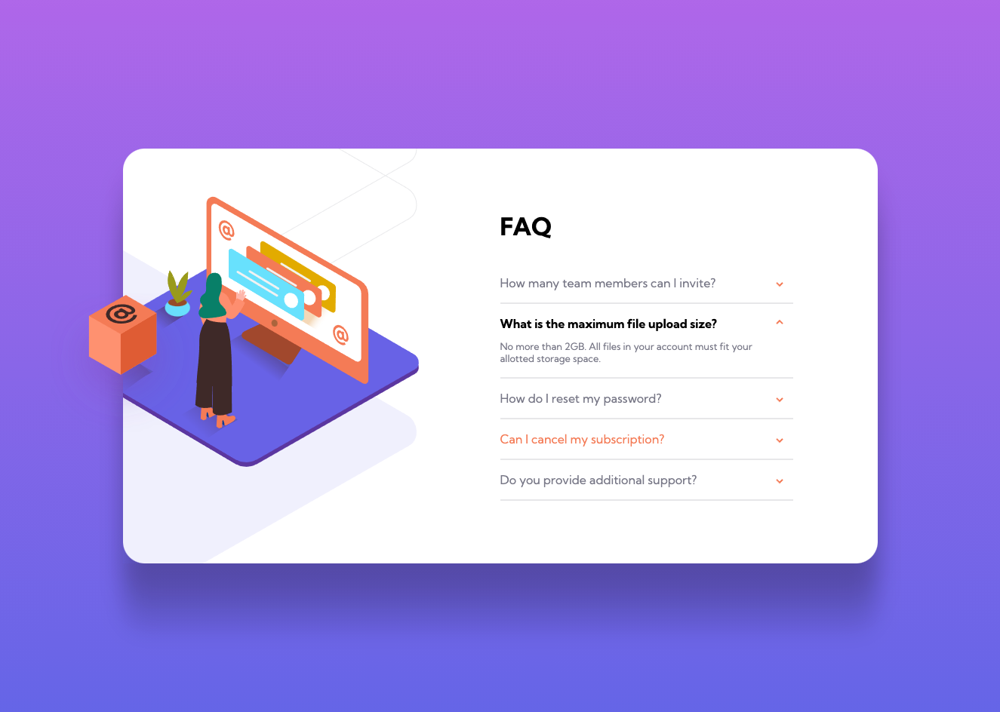
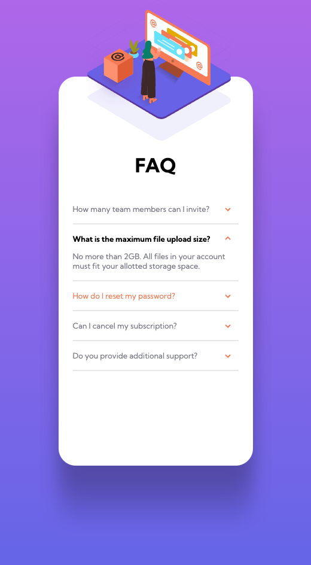

# Frontend Mentor - FAQ accordion card solution

This is a solution to the [FAQ accordion card challenge on Frontend Mentor](https://www.frontendmentor.io/challenges/faq-accordion-card-XlyjD0Oam). Frontend Mentor challenges help you improve your coding skills by building realistic projects. 

## Table of contents

- [Overview](#overview)
  - [The challenge](#the-challenge)
  - [Screenshot](#screenshot)
  - [Links](#links)
- [My process](#my-process)
  - [Built with](#built-with)
- [Author](#author)
- [Acknowledgments](#acknowledgments)

## Overview

### The challenge

Users should be able to:

- See layouts
- Grid and Flex use
- Sass use
- Blend mode usage

### Screenshot

### Links

- Solution URL: [Github](https://github.com/teamdeebo/faq-accordion-card-main)
- Live Site URL: [Live](https://teamdeebo.github.io/faq-accordion-card-main/)

## My process

### Built with

- Semantic HTML5 markup
- CSS custom properties
- Flexbox
- CSS Grid
- Unset

## Author

- Website - [Omar Alexander](https://omardalexander.com)
# Frontend Mentor - FAQ accordion card solution
